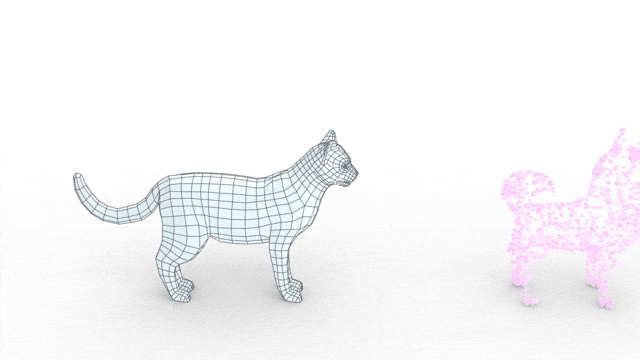

## Mesh Draping

### [Paper](https://arxiv.org/pdf/2110.05433.pdf)

### Running Mesh Draping

Install environment:
```
conda env create -f environment.yml 
conda activate MeshDraping
```
Install [Pytorch](https://pytorch.org/) 

Run UI:
```
python drape_ui.py horse wolf

python drape_ui.py face_target augustus
```

- Mark correspondences points by left click on the source (left) and the target (right) shapes.
- Right click to undo last mark.
- Press enter to update the initial deformation.
- Press the "Draping" to start the optimization. You may mark additional correspondences to refine the result. 
